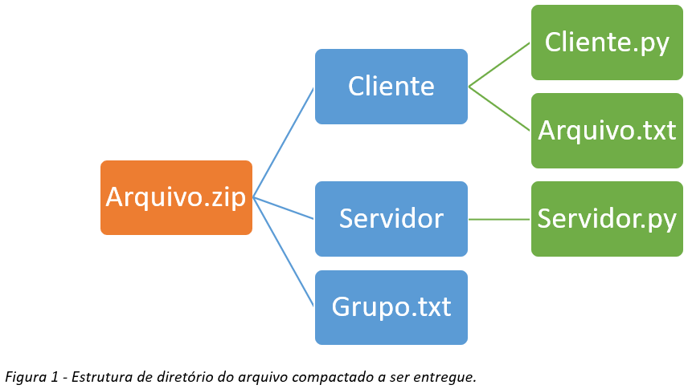

# Atividade Final da disciplina de redes de computadores

Tipos: Atividade em grupo – Até 4 pessoas
Entrega: Arquivo compactando, tendo a sua estrutura apresentada na Figura 1. O arquivo grupo.txt deverá conter o nome completo de todos os membros ao grupo e o link do vídeo ( Máximo 10 minutos).

## Atividade

Desenvolva um sistema de envio de arquivo em qualquer linguagem de programação, para isso use socket tcp com arquitetura cliente-servidor.

A aplicação cliente deverá respeitar a seguinte sintaxe: `python3 cliente.py <ip-do-servidor> <arquivo>` ( Exemplo: `python3 cliente.py localhost arquivo.txt ou cliente.exe localhost arquivo.txt`). [Argumentos em python](https://www.tutorialspoint.com/python/python_command_line_arguments.htm)

A aplicação servidora, deverá receber o arquivo enviado pelo cliente e salvar no seu próprio diretório. Não é necessário trabalhar com threads, apenas 1 conexão por vez.
